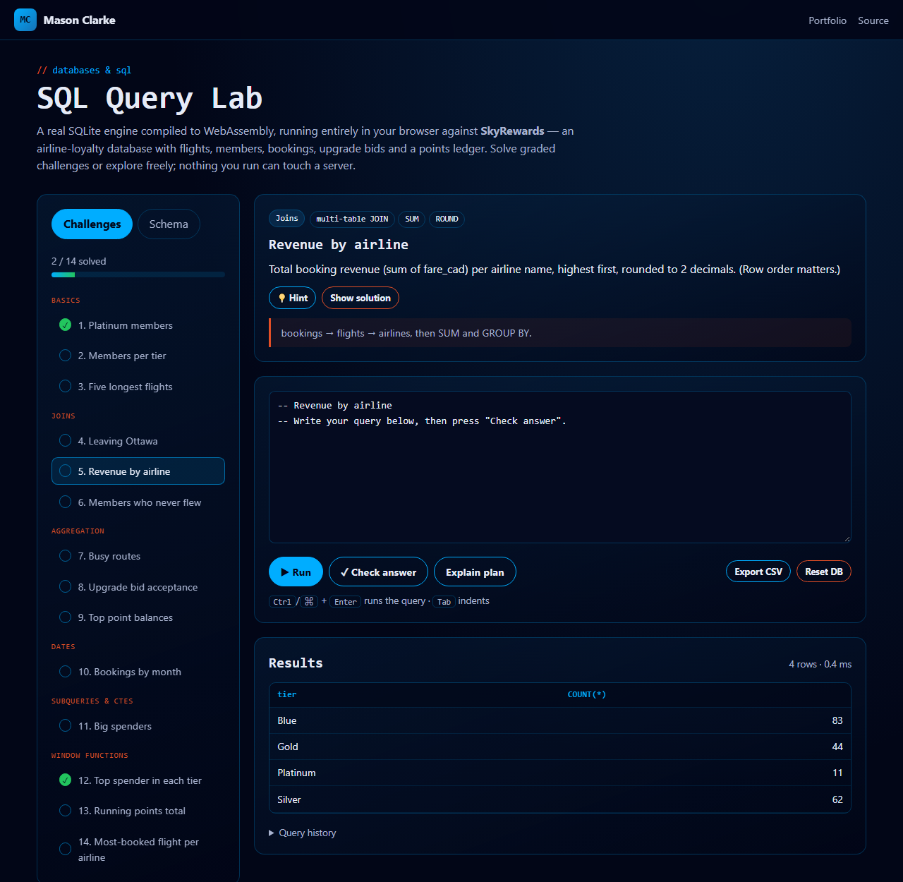

# SQL Query Lab

[](https://github.com/Masons-coding/sql-query-lab/actions/workflows/ci.yml)

**Live demo → https://masons-coding.github.io/sql-query-lab/**

A SQL playground where a real SQLite engine, compiled to WebAssembly, runs entirely in the browser. It comes with **SkyRewards**, a seeded airline-loyalty database, and 14 auto-graded challenges that go from `SELECT` to window functions.



## Features

- **14 graded challenges** across basics, joins, aggregation, dates, CTEs and window functions. Progress is saved locally.
- **Fair grading**: answers run on a fresh copy of the database and are compared as multisets. Column aliases are ignored, floats are compared to 2 dp, and row order only matters when the question says so. Failures explain *why* (wrong column count, wrong order, and so on).
- **Schema browser** with primary and foreign keys, types and row counts. Click a table to preview it.
- **Explain plan** renders `EXPLAIN QUERY PLAN` as a tree and highlights index `SEARCH` vs full-table `SCAN`.
- Query history, CSV export and a one-click database reset. Foreign keys are enforced, so try `DELETE FROM bookings;`.

## The SkyRewards schema

```
airports(code PK, city, country)
airlines(id PK, name UNIQUE, alliance)
flights(id PK, airline_id FK, flight_no, origin FK, destination FK, departs_at, distance_km, …)
members(id PK, first_name, last_name, email UNIQUE, tier CHECK, joined_on, home_airport FK)
bookings(id PK, member_id FK, flight_id FK, cabin CHECK, fare_cad, booked_on)
upgrade_bids(id PK, booking_id FK, bid_cad CHECK > 0, status CHECK, submitted_at)
points_ledger(id PK, member_id FK, delta, reason, created_at)
```

About 1,500 rows are generated by a seeded PRNG (`src/dataset.js`), so the data is identical for every visitor and in CI. Flight distances use the haversine great-circle formula.

## Computer-science concepts

| Concept | Where |
| --- | --- |
| Relational modelling: PK, FK, CHECK and UNIQUE constraints, indexes | `src/dataset.js` |
| Joins, anti-joins, aggregation, HAVING, CTEs, window functions | `src/challenges.js` |
| Query planning and index usage | *Explain plan* button |
| Result-set equivalence (multiset comparison, normalisation) | `src/grader.js` |
| A tokenizer that splits SQL scripts while respecting strings and comments | `src/grader.js` |
| WebAssembly, Subresource Integrity, Content-Security-Policy | `index.html` |

## Run locally

```bash
npm install     # installs sql.js for the test suite
npm test        # 24 tests: every challenge solution runs on real SQLite and grades itself
npx serve .
```

---

Built by [Mason Clarke](https://masons-resume-website.netlify.app) · [LinkedIn](https://www.linkedin.com/in/mason-clarke/)
